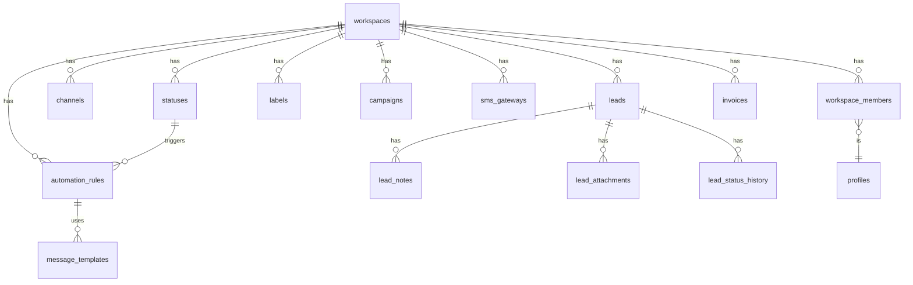

## الهدف
إنشاء الأساس التقني الكامل للنظام: تصميم قاعدة البيانات، سياسات الأمان، وهيكلة المشروع مع Layout أساسي قابل للتوسع.

---

## المرحلة 1: هيكل قاعدة البيانات PostgreSQL (Supabase)

### مخطط العلاقات



### الجداول والـ SQL

#### `supabase/migrations/001_init_schema.sql`

**أ. جدول `profiles` (ملفات المستخدمين)**
```sql
create table public.profiles (
  id uuid primary key references auth.users(id) on delete cascade,
  full_name text,
  avatar_url text,
  phone text,
  created_at timestamptz default now(),
  updated_at timestamptz default now()
);
```

**ب. جدول `workspaces` (مساحات العمل - Multi-Tenant)**
```sql
create table public.workspaces (
  id uuid primary key default gen_random_uuid(),
  name text not null,
  slug text unique not null,
  logo_url text,
  settings jsonb default '{}',
  created_at timestamptz default now(),
  updated_at timestamptz default now(),
  deleted_at timestamptz -- Soft Delete
);
```

**ج. جدول `workspace_members` (الأدوار والصلاحيات - RBAC)**
```sql
create type public.member_role as enum (
  'owner', 'admin', 'agent', 'reservation_manager'
);

create table public.workspace_members (
  id uuid primary key default gen_random_uuid(),
  workspace_id uuid not null references workspaces(id) on delete cascade,
  user_id uuid not null references profiles(id) on delete cascade,
  role member_role not null default 'agent',
  is_active boolean default true,
  invited_by uuid references profiles(id),
  joined_at timestamptz default now(),
  unique(workspace_id, user_id)
);
```

**د. الجداول الديناميكية (Settings)**
```sql
-- قنوات الجلب
create table public.channels (
  id uuid primary key default gen_random_uuid(),
  workspace_id uuid not null references workspaces(id) on delete cascade,
  name text not null,
  type text not null, -- 'landing_page' | 'contact_us' | 'manual' | 'phone' | 'facebook' | ...
  is_active boolean default true,
  created_at timestamptz default now()
);

-- حالات العميل
create table public.statuses (
  id uuid primary key default gen_random_uuid(),
  workspace_id uuid not null references workspaces(id) on delete cascade,
  name text not null,
  color text default '#6B7280',
  sort_order int default 0,
  is_active boolean default true,
  created_at timestamptz default now()
);

-- التصنيفات
create table public.labels (
  id uuid primary key default gen_random_uuid(),
  workspace_id uuid not null references workspaces(id) on delete cascade,
  name text not null,
  color text default '#6B7280',
  created_at timestamptz default now()
);

-- الحملات
create table public.campaigns (
  id uuid primary key default gen_random_uuid(),
  workspace_id uuid not null references workspaces(id) on delete cascade,
  name text not null,
  description text,
  is_active boolean default true,
  starts_at timestamptz,
  ends_at timestamptz,
  created_at timestamptz default now(),
  deleted_at timestamptz -- Soft Delete
);

-- إعدادات SMS
create table public.sms_gateways (
  id uuid primary key default gen_random_uuid(),
  workspace_id uuid not null references workspaces(id) on delete cascade,
  provider_name text not null,
  api_key_encrypted text, -- مشفر
  sender_name text,
  is_active boolean default true,
  created_at timestamptz default now()
);
```

**هـ. جدول `leads` (العملاء المحتملون - الجوهر)**
```sql
create table public.leads (
  id uuid primary key default gen_random_uuid(),
  workspace_id uuid not null references workspaces(id) on delete cascade,
  full_name text not null,
  email text,
  phone text,
  notes text,
  status_id uuid references statuses(id) on delete set null,
  channel_id uuid references channels(id) on delete set null,
  campaign_id uuid references campaigns(id) on delete set null,
  label_id uuid references labels(id) on delete set null,
  assigned_to uuid references profiles(id) on delete set null,
  source_metadata jsonb default '{}', -- بيانات إضافية من Facebook, etc.
  created_by uuid references profiles(id),
  created_at timestamptz default now(),
  updated_at timestamptz default now(),
  deleted_at timestamptz -- Soft Delete (Trash)
);

-- ملاحظات العميل
create table public.lead_notes (
  id uuid primary key default gen_random_uuid(),
  lead_id uuid not null references leads(id) on delete cascade,
  workspace_id uuid not null references workspaces(id) on delete cascade,
  content text not null,
  created_by uuid references profiles(id),
  created_at timestamptz default now()
);

-- مرفقات العميل
create table public.lead_attachments (
  id uuid primary key default gen_random_uuid(),
  lead_id uuid not null references leads(id) on delete cascade,
  workspace_id uuid not null references workspaces(id) on delete cascade,
  file_name text not null,
  file_url text not null,
  file_size int,
  mime_type text,
  uploaded_by uuid references profiles(id),
  created_at timestamptz default now()
);

-- سجل تغيير حالة العميل
create table public.lead_status_history (
  id uuid primary key default gen_random_uuid(),
  lead_id uuid not null references leads(id) on delete cascade,
  workspace_id uuid not null references workspaces(id) on delete cascade,
  old_status_id uuid references statuses(id) on delete set null,
  new_status_id uuid references statuses(id) on delete set null,
  changed_by uuid references profiles(id),
  changed_at timestamptz default now()
);
```

**و. نظام الأتمتة**
```sql
-- قوالب الرسائل
create table public.message_templates (
  id uuid primary key default gen_random_uuid(),
  workspace_id uuid not null references workspaces(id) on delete cascade,
  name text not null,
  type text not null check (type in ('sms', 'email')),
  subject text, -- للبريد الإلكتروني فقط
  body text not null, -- يدعم {{lead_name}}, {{agent_name}} placeholders
  created_at timestamptz default now()
);

-- قواعد الأتمتة
create table public.automation_rules (
  id uuid primary key default gen_random_uuid(),
  workspace_id uuid not null references workspaces(id) on delete cascade,
  name text not null,
  trigger_type text not null default 'status_change',
  trigger_status_id uuid references statuses(id) on delete cascade,
  action_type text not null check (action_type in ('send_sms', 'send_email')),
  template_id uuid references message_templates(id) on delete cascade,
  gateway_id uuid references sms_gateways(id) on delete set null,
  is_active boolean default true,
  created_at timestamptz default now()
);
```

**ز. الفوترة**
```sql
create table public.invoices (
  id uuid primary key default gen_random_uuid(),
  workspace_id uuid not null references workspaces(id) on delete cascade,
  lead_id uuid references leads(id) on delete set null,
  total_amount decimal(12,2) not null default 0,
  discount decimal(12,2) default 0,
  due_amount decimal(12,2) generated always as (total_amount - discount) stored,
  paid_amount decimal(12,2) default 0,
  due_date date,
  status text default 'pending' check (status in ('pending','partial','paid','overdue')),
  notes text,
  created_by uuid references profiles(id),
  created_at timestamptz default now(),
  updated_at timestamptz default now(),
  deleted_at timestamptz -- Soft Delete
);
```

**ح. Indexes للأداء**
```sql
create index idx_leads_workspace on leads(workspace_id) where deleted_at is null;
create index idx_leads_status on leads(status_id);
create index idx_leads_assigned on leads(assigned_to);
create index idx_leads_created on leads(created_at desc);
create index idx_members_workspace_user on workspace_members(workspace_id, user_id);
create index idx_status_history_lead on lead_status_history(lead_id, changed_at desc);
```

**ط. Triggers للتحديث التلقائي**
```sql
create or replace function update_updated_at()
returns trigger language plpgsql as $$
begin new.updated_at = now(); return new; end;
$$;

create trigger trg_leads_updated before update on leads
  for each row execute function update_updated_at();

create trigger trg_workspaces_updated before update on workspaces
  for each row execute function update_updated_at();
```

---

## المرحلة 2: سياسات الأمان RLS

### دالة مساعدة مركزية

```sql
-- `supabase/migrations/002_rls_helpers.sql`

-- تحديد دور المستخدم في مساحة العمل
create or replace function public.get_my_role(ws_id uuid)
returns member_role language sql stable security definer as $$
  select role from workspace_members
  where workspace_id = ws_id and user_id = auth.uid() and is_active = true
  limit 1;
$$;

-- التحقق إذا كان المستخدم ينتمي لمساحة العمل
create or replace function public.is_workspace_member(ws_id uuid)
returns boolean language sql stable security definer as $$
  select exists (
    select 1 from workspace_members
    where workspace_id = ws_id and user_id = auth.uid() and is_active = true
  );
$$;
```

### مصفوفة الصلاحيات

| الإجراء | Owner | Admin | Agent | Reservation Manager |
|---------|-------|-------|-------|---------------------|
| إدارة أعضاء الفريق | ✅ | ✅ | ❌ | ❌ |
| إعدادات النظام (Channels/Statuses) | ✅ | ✅ | ❌ | ❌ |
| حذف Lead نهائياً | ✅ | ✅ | ❌ | ❌ |
| إنشاء Lead | ✅ | ✅ | ✅ | ✅ |
| تعديل Lead | ✅ | ✅ | ✅ (المسندة له) | ✅ (المسندة له) |
| عرض جميع Leads | ✅ | ✅ | ✅ | ✅ |
| إدارة الحملات | ✅ | ✅ | ❌ | ❌ |
| عرض التقارير | ✅ | ✅ | ❌ | ❌ |
| الفوترة | ✅ | ✅ | ❌ | ✅ |

### تطبيق RLS

```sql
-- `supabase/migrations/003_rls_policies.sql`

-- تفعيل RLS على جميع الجداول
alter table workspaces enable row level security;
alter table workspace_members enable row level security;
alter table leads enable row level security;
alter table lead_notes enable row level security;
alter table lead_attachments enable row level security;
alter table lead_status_history enable row level security;
alter table channels enable row level security;
alter table statuses enable row level security;
alter table labels enable row level security;
alter table campaigns enable row level security;
alter table message_templates enable row level security;
alter table automation_rules enable row level security;
alter table invoices enable row level security;

-- Leads: عرض جميع أعضاء المساحة
create policy "leads_select" on leads for select
  using (is_workspace_member(workspace_id) and deleted_at is null);

-- Leads: إنشاء لجميع الأعضاء
create policy "leads_insert" on leads for insert
  with check (is_workspace_member(workspace_id));

-- Leads: تعديل (الـ Admin/Owner يعدل الكل، الـ Agent يعدل المسندة له)
create policy "leads_update" on leads for update
  using (
    get_my_role(workspace_id) in ('owner', 'admin') or
    (get_my_role(workspace_id) in ('agent', 'reservation_manager') and assigned_to = auth.uid())
  );

-- Leads: حذف ناعم (Soft Delete) للـ Admin+
create policy "leads_soft_delete" on leads for update
  using (get_my_role(workspace_id) in ('owner', 'admin'));

-- Channels/Statuses: القراءة للجميع، الكتابة للـ Admin+
create policy "channels_select" on channels for select
  using (is_workspace_member(workspace_id));

create policy "channels_write" on channels for all
  using (get_my_role(workspace_id) in ('owner', 'admin'));

-- نفس النمط لـ statuses, labels, campaigns, automation_rules, message_templates

-- Invoices: عرض وتعديل لـ Owner/Admin/ReservationManager
create policy "invoices_access" on invoices for all
  using (get_my_role(workspace_id) in ('owner', 'admin', 'reservation_manager'));
```

---

## المرحلة 3: هيكلة Nuxt 3 والـ Layout الأساسي

### هيكل المجلدات

```
F:\crmSaas\
├── nuxt.config.ts
├── app.vue
├── middleware/
│   ├── auth.ts              # التحقق من تسجيل الدخول
│   └── workspace.ts         # التحقق من صلاحية الوصول للـ Workspace
├── layouts/
│   ├── default.vue          # Layout مع Sidebar (للصفحات المحمية)
│   └── auth.vue             # Layout بسيط (لصفحات Login/Register)
├── pages/
│   ├── auth/
│   │   ├── login.vue
│   │   └── register.vue
│   ├── [workspace]/
│   │   ├── dashboard.vue
│   │   ├── leads/
│   │   │   ├── index.vue    # قائمة Leads مع DataTable
│   │   │   ├── [id].vue     # تفاصيل Lead
│   │   │   └── trash.vue    # السلة
│   │   ├── settings/
│   │   │   ├── channels.vue
│   │   │   ├── statuses.vue
│   │   │   ├── labels.vue
│   │   │   ├── campaigns.vue
│   │   │   ├── team.vue
│   │   │   └── sms.vue
│   │   ├── reports.vue
│   │   └── invoices/
│   │       └── index.vue
├── components/
│   ├── layout/
│   │   ├── AppSidebar.vue
│   │   ├── AppHeader.vue
│   │   └── AppBreadcrumb.vue
│   ├── leads/
│   │   ├── LeadTable.vue
│   │   ├── LeadForm.vue
│   │   └── LeadStatusBadge.vue
│   └── ui/
│       ├── BaseModal.vue
│       ├── BaseButton.vue
│       ├── BaseInput.vue
│       └── DataTable.vue
├── composables/
│   ├── useWorkspace.ts      # الـ Workspace الحالي وصلاحيات المستخدم
│   ├── useLeads.ts
│   └── usePermissions.ts    # RBAC على مستوى الواجهة
├── server/
│   ├── api/
│   │   ├── [workspace]/
│   │   │   ├── leads/
│   │   │   │   ├── index.get.ts    # GET: قائمة الـ Leads
│   │   │   │   ├── index.post.ts   # POST: إنشاء Lead
│   │   │   │   ├── [id].get.ts     # GET: تفاصيل Lead
│   │   │   │   ├── [id].put.ts     # PUT: تعديل Lead
│   │   │   │   └── [id].delete.ts  # DELETE: Soft Delete
│   │   │   ├── settings/
│   │   │   │   ├── channels.get.ts
│   │   │   │   └── statuses.get.ts
│   │   │   └── reports/
│   │   │       └── index.get.ts
│   │   └── webhooks/
│   │       └── facebook.post.ts    # Facebook Lead Gen Webhook
│   └── utils/
│       ├── supabase.ts      # Supabase Server Client (Service Role)
│       └── permissions.ts   # دوال التحقق من الصلاحيات Server-Side
├── plugins/
│   └── supabase.client.ts
└── stores/
    ├── auth.ts              # Pinia: بيانات المستخدم
    └── workspace.ts         # Pinia: بيانات الـ Workspace الحالي
```

### الكود الأساسي

#### `nuxt.config.ts`
```ts
export default defineNuxtConfig({
  modules: ['@nuxtjs/tailwindcss', '@pinia/nuxt', '@nuxtjs/supabase'],
  supabase: { redirectOptions: { login: '/auth/login', callback: '/confirm' } },
  runtimeConfig: {
    supabaseServiceKey: process.env.SUPABASE_SERVICE_KEY,
    public: {
      supabaseUrl: process.env.SUPABASE_URL,
      supabaseKey: process.env.SUPABASE_ANON_KEY
    }
  }
})
```

#### `layouts/default.vue` (Layout مع Sidebar)
```vue
<template>
  <div class="flex h-screen bg-gray-50 overflow-hidden" :dir="'rtl'">
    <!-- Sidebar -->
    <AppSidebar :collapsed="sidebarCollapsed" />
    
    <!-- Main Content -->
    <div class="flex flex-col flex-1 overflow-hidden">
      <AppHeader @toggle-sidebar="sidebarCollapsed = !sidebarCollapsed" />
      <main class="flex-1 overflow-y-auto p-6">
        <AppBreadcrumb />
        <slot />
      </main>
    </div>
  </div>
</template>

<script setup lang="ts">
const sidebarCollapsed = ref(false)
</script>
```

#### `components/layout/AppSidebar.vue`
```vue
<template>
  <aside
    class="flex flex-col bg-gray-900 text-white transition-all duration-300"
    :class="collapsed ? 'w-16' : 'w-64'"
  >
    <!-- Logo -->
    <div class="flex items-center gap-3 px-4 h-16 border-b border-gray-700">
      
      <span v-if="!collapsed" class="font-bold text-lg truncate">{{ workspace?.name }}</span>
    </div>

    <!-- Navigation -->
    <nav class="flex-1 py-4 space-y-1 overflow-y-auto">
      <SidebarItem v-for="item in navItems" :key="item.to"
        :item="item" :collapsed="collapsed"
        v-if="can(item.permission)"
      />
    </nav>

    <!-- User Info -->
    <div class="border-t border-gray-700 p-3">
      <div class="flex items-center gap-3">
        
        <div v-if="!collapsed" class="flex-1 min-w-0">
          <p class="text-sm font-medium truncate">{{ user?.full_name }}</p>
          <p class="text-xs text-gray-400 truncate">{{ myRole }}</p>
        </div>
      </div>
    </div>
  </aside>
</template>

<script setup lang="ts">
const { workspace, myRole } = useWorkspace()
const { can } = usePermissions()
const { user } = useSupabaseUser()

const navItems = [
  { label: 'لوحة التحكم', icon: 'i-heroicons-home', to: 'dashboard', permission: null },
  { label: 'العملاء المحتملون', icon: 'i-heroicons-users', to: 'leads', permission: null },
  { label: 'التقارير', icon: 'i-heroicons-chart-bar', to: 'reports', permission: 'view_reports' },
  { label: 'الفواتير', icon: 'i-heroicons-document-text', to: 'invoices', permission: 'view_invoices' },
  { label: 'الإعدادات', icon: 'i-heroicons-cog-6-tooth', to: 'settings', permission: 'manage_settings' },
]
</script>
```

#### `composables/usePermissions.ts` (RBAC على الواجهة)
```ts
export const usePermissions = () => {
  const { myRole } = useWorkspace()

  const permissionsMap: Record<string, string[]> = {
    manage_settings: ['owner', 'admin'],
    delete_lead: ['owner', 'admin'],
    view_reports: ['owner', 'admin'],
    view_invoices: ['owner', 'admin', 'reservation_manager'],
    manage_team: ['owner', 'admin'],
  }

  const can = (permission: string | null): boolean => {
    if (!permission) return true
    return permissionsMap[permission]?.includes(myRole.value) ?? false
  }

  return { can }
}
```

#### `server/api/[workspace]/leads/index.get.ts`
```ts
export default defineEventHandler(async (event) => {
  const workspaceSlug = getRouterParam(event, 'workspace')
  const query = getQuery(event)
  const supabase = await useServerSupabase(event) // Service Role client

  const { data, error, count } = await supabase
    .from('leads')
    .select(`
      *, 
      status:statuses(id,name,color),
      channel:channels(id,name),
      campaign:campaigns(id,name),
      assigned_agent:profiles(id,full_name,avatar_url)
    `, { count: 'exact' })
    .eq('workspace_id', query.workspaceId)
    .is('deleted_at', null)
    .order('created_at', { ascending: false })
    .range(Number(query.from ?? 0), Number(query.to ?? 49))

  if (error) throw createError({ statusCode: 500, message: error.message })
  return { data, total: count }
})
```

#### `server/api/webhooks/facebook.post.ts` (Webhook لاستقبال Leads)
```ts
export default defineEventHandler(async (event) => {
  // التحقق من Hub.challenge عند الإعداد الأول
  const query = getQuery(event)
  if (query['hub.mode'] === 'subscribe') {
    return sendNoContent(event) // إرجاع hub.challenge
  }

  const body = await readBody(event)
  const supabase = useServiceRoleClient() // Service Role - تجاوز RLS

  // معالجة كل Lead في الـ Payload
  for (const entry of body.entry ?? []) {
    for (const change of entry.changes ?? []) {
      if (change.field !== 'leadgen') continue
      const leadData = change.value

      await supabase.from('leads').insert({
        workspace_id: leadData.page_id, // يحتاج ربط page_id بـ workspace
        full_name: leadData.field_data?.find(f => f.name === 'full_name')?.values[0],
        email: leadData.field_data?.find(f => f.name === 'email')?.values[0],
        phone: leadData.field_data?.find(f => f.name === 'phone_number')?.values[0],
        channel_id: '...', // ID قناة Facebook المسبق الإنشاء
        source_metadata: leadData,
      })
    }
  }
  return { ok: true }
})
```

---

## ترتيب التنفيذ والتحقق

| الخطوة | الملفات المستهدفة | التحقق (DoD) |
|--------|------------------|--------------|
| 1. إعداد المشروع | `nuxt.config.ts`, `.env` | `nuxt dev` يعمل بدون أخطاء |
| 2. Migration قاعدة البيانات | `supabase/migrations/001-003` | جميع الجداول موجودة في Supabase Dashboard |
| 3. RLS & Helpers | `migrations/002-003` | اختبار الصلاحيات عبر Supabase Policy Editor |
| 4. Layout & Sidebar | `layouts/`, `components/layout/` | الصفحات تظهر بتصميم صحيح RTL |
| 5. RBAC Composable | `composables/usePermissions.ts` | عناصر الواجهة تظهر/تختفي بناءً على الدور |
| 6. Server API - Leads | `server/api/[workspace]/leads/` | API تستجيب بالبيانات الصحيحة |
| 7. Facebook Webhook | `server/api/webhooks/facebook.post.ts` | استقبال Lead تجريبي من Meta Webhooks Tester |

---

## المتطلبات والحزم

```bash
npx nuxi@latest init crmSaas
cd crmSaas
npm install @nuxtjs/supabase @pinia/nuxt @nuxtjs/tailwindcss
npm install @heroicons/vue xlsx  # لاستيراد/تصدير Excel
```

```env
# .env
SUPABASE_URL=https://xxxx.supabase.co
SUPABASE_KEY=your-anon-key
SUPABASE_SERVICE_KEY=your-service-role-key
```
